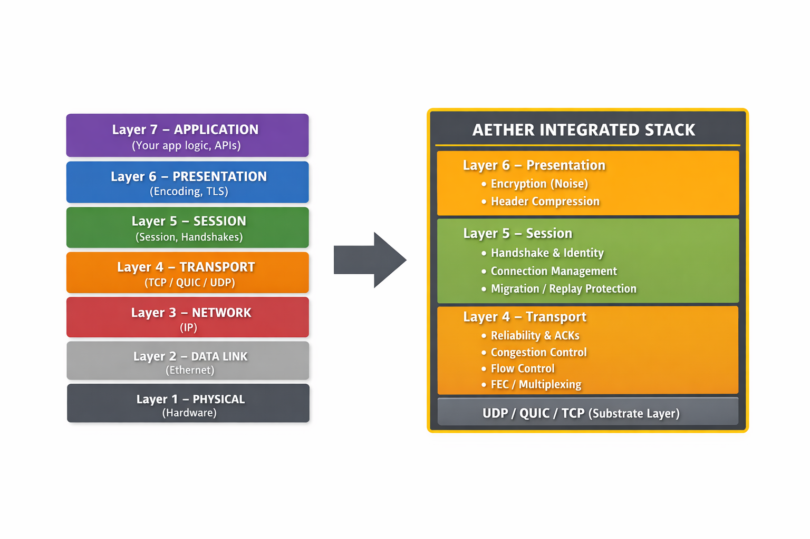

# Aether

> *Write your networking stack once, run it everywhere — without giving up transport-level control.*

[](https://go.dev)
[](LICENSE)

A protocol and wire format that standardises communication between application and transport layers, allowing systems to operate across layers 7 to 4 with minimal translation overhead and without losing core capabilities.

```bash
go get github.com/ORBTR/aether
```

## API Docs

Generated API reference (pkgsite) for each tagged release is published to GitHub Pages:

- Latest: https://orbtr.github.io/aether/github.com/ORBTR/aether/
- Published by `.github/workflows/docs.yml` on every `v*` tag.

---

## Overview

Aether is a unified transport and session protocol that collapses layers 4 through 6 into a single programmable interface, allowing applications to communicate with consistent semantics across UDP, QUIC, TCP, and WebAssembly environments.

Providing a consistent, end-to-end communication layer that eliminates transport-level fragmentation. Applications can use the same protocol across native, browser, and relay environments without rewriting networking logic or sacrificing advanced capabilities like multiplexing, congestion control, and NAT traversal.



*Clean interfaces for Layer 7 applications and natively supporting any consumer Layer 3 with multipathing.*

---

## Architecture

```
Application
    └── Session (transport-agnostic, multiplexed)
            ├── Stream 0  ──► net.Conn virtual wire
            ├── Stream 1  ──► net.Conn virtual wire
            └── Stream N  ──► net.Conn virtual wire

Aether Protocol Layer
    ├── Frame Codec (50B canonical + v2 short headers: 4–9B)
    ├── Reliability Engine (per-stream SACK, retransmit, RTT estimation)
    ├── Forward Error Correction (XOR, Interleaved XOR, Reed-Solomon)
    ├── Congestion Control (CUBIC, BBRv2, ECN-aware)
    ├── Pacing (token bucket + send-time scheduling)
    ├── Flow Control (stream 256KB + connection 1MB → 16MB)
    ├── WFQ Scheduler (REALTIME > INTERACTIVE > BULK)
    ├── Anti-Replay (per-stream 64-bit + per-connection 128-bit)
    ├── PMTU Discovery (ascending probes, 10-minute re-probe)
    ├── Connection Migration (HMAC-validated address change)
    └── Adaptive CPU Load-Shedding (progressive feature disable)

Transport Layer
    ├── Noise-UDP (A-FULL — full Aether stack)
    ├── QUIC (A-LITE — native reliability/mux/congestion)
    ├── WebSocket (A-LITE — native reliability)
    ├── TCP/TLS (A-LITE — native reliability)
    └── gRPC (A-LITE — native reliability/mux)
```

### Capability-Based Layer Selection

Each transport declares native capabilities, and Aether activates its own layers only to fill the gaps. Noise-UDP provides only encryption and identity — Aether implements everything else. QUIC already provides reliability, congestion, flow control, and mux — Aether bypasses its own layers to avoid redundant work.

| Capability | Noise-UDP | QUIC | WS/TCP | gRPC |
|-----------|-----------|------|--------|------|
| Reliability | **Aether provides** | Transport-native | Transport-native | Transport-native |
| Flow Control | **Aether provides** | Transport-native | **Aether provides** | Transport-native |
| Congestion | **Aether provides** | Transport-native | **Aether provides** | Transport-native |
| Encryption | Transport-native (Noise) | Transport-native | Transport-native | Transport-native |
| Mux | **Aether provides** | Transport-native | **Aether provides** | Transport-native |
| Ordering | **Aether provides** | Transport-native | Transport-native | Transport-native |
| Identity | Transport-native (Ed25519) | Transport-native | Transport-native | Transport-native |
| FEC | **Aether provides** | N/A | N/A | N/A |

---

## Features

### Protocol
- **50-byte canonical wire format** with 6-type v2 short header compression (4–9 bytes, 82–92% savings)
- **17 frame types** — data, control, reliability, flow, observability, NAT traversal
- **Stream multiplexing** with consumer-defined stream IDs via `StreamLayout`
- **5 reliability modes** — reliable ordered/unordered, unreliable ordered/sequenced, best-effort (with MaxRetries/MaxAge)
- **Deadline-based reliability** — frames older than `MaxAge` are dropped by sender and receiver

### Reliability & Performance
- **Composite ACK** — adaptive bitmap ACK with cumulative, SACK, dropped ranges, and loss density extensions
- **Jacobson/Karels RTT estimation** (RFC 6298) with ACK delay compensation
- **Forward error correction** — XOR (25% overhead), Interleaved XOR (burst recovery), Reed-Solomon (arbitrary k,m recovery)
- **CUBIC** (RFC 8312, default) and **BBRv2** (4-phase state machine with delivery rate sampling) congestion control
- **Send-time pacing** — token bucket (CUBIC) + send-time scheduling (BBRv2)
- **ECN support** — `OnCE()` congestion signal for ECN-capable infrastructure
- **WFQ priority scheduler** — 3 latency classes (REALTIME > INTERACTIVE > BULK), per-stream weights, FEC cost bonus, REALTIME 10% bandwidth cap
- **Credit-based flow control** — stream (256KB) + connection (1MB, auto-grow to 16MB), 25% auto-grant, 1KB MinGuaranteedWindow deadlock prevention
- **Anti-replay** — per-stream 64-bit + per-connection 128-bit sliding windows (DATA frames only)
- **MTU-aware fragmentation** — per-fragment ACK/retransmit/FEC, transparent reassembly

### Transport & Security
- **Noise XX/XK handshakes** with Ed25519 identity, explicit-nonce reordering tolerance, automatic rekeying (1 GiB / 10 min)
- **Per-frame AEAD encryption** — ChaCha20-Poly1305 with 3-key HKDF derivation (never disabled, even under CPU pressure)
- **Session resume** — 0-RTT reconnection tokens with forward-secret key derivation (Memory, File, Browser stores)
- **Connection migration** — HMAC-SHA256 validated address change without re-handshake
- **Multi-tenant scope isolation** — preamble system, scope-bound relay tickets, per-scope rate limiting

### NAT Traversal
- **RFC 5780 NAT behaviour discovery** — full EIM/ADM/APDM mapping + EIF/ADF/APDF filtering classification
- **Coordinated hole-punching** — simultaneous open for EIM↔EIM, asymmetric for mixed NAT types
- **Birthday paradox port prediction** — for symmetric↔symmetric NAT (APDM↔APDM)
- **UPnP / NAT-PMP / PCP port mapping** — automatic gateway discovery and mapping
- **Strategy engine** — orchestrates all methods with automatic relay fallback

### Platform
- **WASM/browser support** — `syscall/js` native WebSocket transport
- **HTTP/1.1 Upgrade hijack** — proxy-safe fallback for Fly.io/Cloudflare
- **Adaptive CPU load-shedding** — progressive feature disable at 70/80/90% CPU with hysteresis (encryption is never disabled)
- **Multipath** — Level 1 (active/standby failover), Level 2 (redundant REALTIME), Level 3 (weighted load balance)
- **Agnostic design** — no hardcoded stream IDs, no tenant logic; consumers define their own `StreamLayout`

---

## Usage

```go
import "github.com/ORBTR/aether"

// Create a Noise-UDP session
session, err := adapter.NewNoiseSession(conn, opts)

// Open a reliable ordered stream with INTERACTIVE priority
stream, err := session.OpenStream(ctx, aether.StreamConfig{
    StreamID:     1,
    Reliability:  aether.ReliableOrdered,
    Priority:     128,
    LatencyClass: aether.ClassINTERACTIVE,
})

// Use as net.Conn — io.Copy, http.Serve, bufio.Scanner all work
io.Copy(stream.Conn(), file) // sends any size, chunked, paced, reliable
http.Serve(stream.Conn(), handler) // HTTP over mesh

// Or use message-oriented API
stream.Send(ctx, payload)
data, err := stream.Receive(ctx)
```

### Consumer Stream Layout Example

```go
// Consumers define their own stream ID assignments
layout := aether.StreamLayout{
    Keepalive: 2,
    Control:   3,
}

// Application streams are consumer-defined
// Stream 0: gossip (BestEffort, BULK)
// Stream 1: RPC (ReliableOrdered, INTERACTIVE)
// Stream 100-102: screen streaming (video/input/control)
// Stream 200+: tunnels (RDP/SSH/VNC)
// Stream 300+: file transfer (2MB credit window)
// Stream 600+: dynamic peer-to-peer streams
```

---

## Sub-packages

| Package | Purpose |
|---------|---------|
| `adapter/` | Per-transport session adapters (Noise, TCP, WS, QUIC, gRPC) |
| `reliability/` | Composite ACK, retransmit, FEC (XOR + interleaved + Reed-Solomon), anti-replay, RTT estimation |
| `congestion/` | CUBIC (RFC 8312), BBRv2 (delivery rate sampling, 4-phase state machine), send-time pacer |
| `flow/` | Stream + connection credit windows with deadlock prevention |
| `scheduler/` | Weighted fair queuing with strict priority classes and cost modifiers |
| `crypto/` | Per-frame AEAD (ChaCha20-Poly1305), 3-key HKDF keyring, identity management |
| `noise/` | Noise XX/XK handshake, session tickets, relay, preamble, rekeying, nonce window |
| `nat/` | RFC 5780 STUN, NAT behaviour discovery, coordinated hole-punching, birthday port prediction, UPnP/NAT-PMP/PCP |
| `relay/` | Relay framing, Ed25519 ticket auth, scope isolation, fallback selection |
| `pmtu/` | Path MTU discovery with ascending probes and periodic re-probing |
| `migration/` | HMAC-validated connection migration tokens |
| `multipath/` | Active/standby failover, redundant REALTIME, weighted load balance |
| `resume/` | 0-RTT session resume tokens with forward-secret key derivation |
| `discovery/` | Chained peer discovery: mDNS → DNS SRV → static seeds |
| `health/` | EMA-smoothed RTT monitoring, liveness detection |
| `grpc/` | gRPC transport adapter |
| `quic/` | QUIC transport adapter |
| `websocket/` | WebSocket transport adapter (including WASM/browser) |
| `rpc/` | RPC wire format (length-prefixed protobuf) |

---

## Documentation

| Document | Purpose |
|----------|---------|
| [Protocol Specification](docs/protocol-spec.md) | Complete wire format specification (v6.1) |

---

## License

[Elastic License 2.0 (ELv2)](LICENSE)

**Patent Pledge**: I, Brandon Miller-Mumford, sole copyright holder of Aether, commit to not assert any patents I hold or acquire covering Aether against users complying with ELv2 terms.
